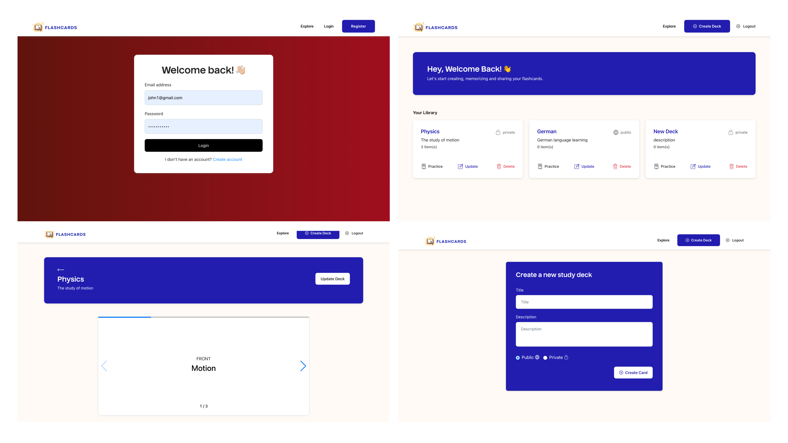

  

  

A spaced repetition learning platform to <b>create</b>, <b>memorize</b> and <b>share</b> your knowledge list using flashcards.

## Watch Flashcards in Action

## Tech Stack

## Getting started & Installation:
- Backend [See README.md](https://github.com/JohnDamilola/FlashCards/blob/main/backend/Readme.md)
- Frontend [See README.md](https://github.com/JohnDamilola/FlashCards/blob/main/frontend/README.md)

## Current Screens

  

  

## Future Roadmap
### Phase 1:
- [x] Create database ER diagram
- [x] User Login
- [x] User Signup/Create Account
- [x] Explore or Search Public FlashCards
- [x] Create/Read/Update/Delete <b>Decks</b> <i>(collections of cards)</i>
- [x] Create/Read/Update/Delete <b>Cards</b>
- [x] FlashCard Practice Mode
- [x] Add Unit testing
- [x] Setup backend and frontend deployment

### Phase 2:
- [ ] Delete User Account
- [ ] Track practice/study progress
- [ ] Tag/Categorize Cards in a deck
- [ ] Daily learning streaks stats
- [ ] Invite friends to a private Study Deck
- [ ] Chrome extension to be able to highlight a text on a website or online pdf and have an extension option from the right click to help me create/add a card to my deck on the spot.

## Contributions to the Project
Please refer to the [Contributing.md](https://github.com/JohnDamilola/FlashCards/blob/main/Contributing.md) if you want to contrbute to the FlashCards source code. Follow all the guidelines mentioned and raise a pull request for the developers to review before the code goes to the main source code.

## Authors 

1. [Kritika Javali](https://github.com/ksjavali)
2. [Swarangi Gaurkar](https://github.com/Swarangigaurkar)
3. [Aaron Dias Barreto](https://github.com/aaron278)
4. [Leo Hsiang](https://github.com/leoohsiang)
5. [Damilola Babalola](https://github.com/JohnDamilola)

## License
[MIT](https://tldrlegal.com/license/mit-license)
